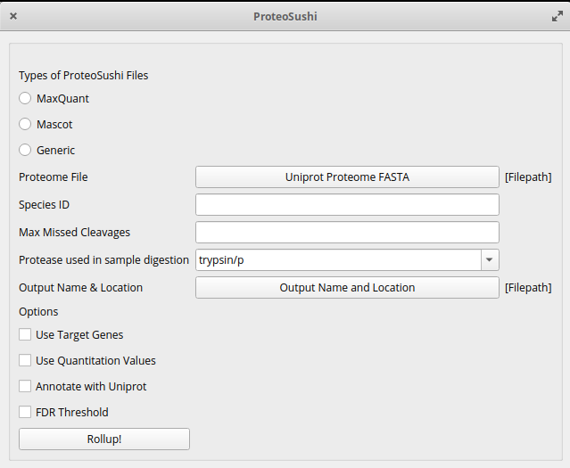
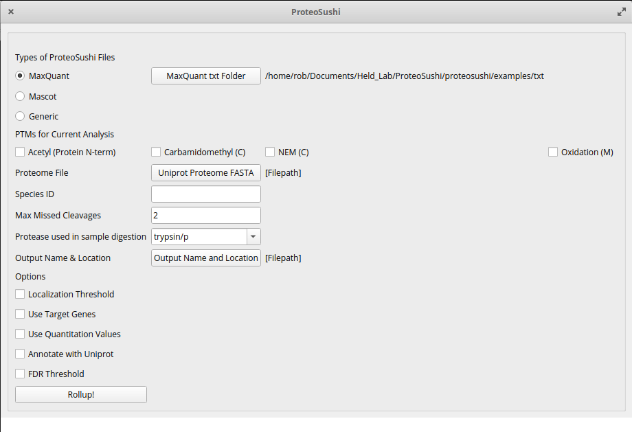
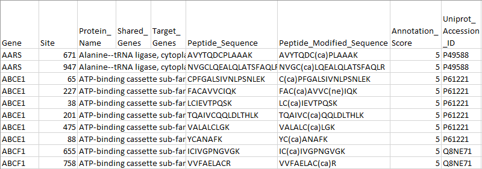

# ProteoSushi

ProteoSushi transforms peptide-centric, PTM-enriched peptide data into condensed and annotated PTM site output that is easy to understand and analyze.

ProteoSushi is designed to be simple to use and easy to access. 

## Requirements

Prior to using ProteoSushi, there are some common, minor requirements so it will work correctly. 
The machine running ProteoSushi must have: 

- stable internet access 

- at least 8GB of RAM, 12GB for Windows 10

  - 16GB or higher is recommended, but ultimately depends on the user's memory usage (having other programs open will decrease the memory available for ProteoSushi). More memory allows for more flexibility in the number and scope of programs running at once.
  
  - With only 8GB of RAM, the user will likely need to free up memory by closing other open programs

- Python version 3.8 or higher installed 

  - earlier versions of python may work, but nothing as early as 2.7 will work
  
## Installation

Download python from [here](https://www.python.org/downloads/) and install if needed.

*Those who have python 2.7 installed along with python 3.x will need to replace the python and pip commands with python3 and pip3 respectively*

There are two ways to install ProteoSushi: 

1. Through **PIP**

This is (likely) the easier way to install.

**In Windows:** 

Open the command prompt by typing `cmd` into the search bar (probably at the bottom of the screeen) and clicking on "Command Prompt" when it pops up. Run the command:

`py -m pip install proteosushi`

While in the command prompt, run ProteoSushi with the command:

`py -m proteosushi`

**In MacOS/Linux:**

Open the terminal in MacOS by either searching for it in spotlight or manually finding it in the application list.

In linux, the terminal is among one of the installed applications. If you use linux, you most likely already know how to use the terminal.

Once the terminal is open, run the command:

`python -m pip install proteosushi`

While the terminal is open, run ProteoSushi with the command:

`python -m proteosushi`

2. Through **Github**

Download the files directly from [GitHub](https://github.com/HeldLab/ProteoSushi). Click on the Code button and then on Download ZIP.

Once unpacked (unzipped), we will need to use the terminal (command prompt in Windows) to run ProteoSushi.

Before running ProteoSushi, you will need to install some dependencies. In the terminal/command prompt, run the following commands:
```
pip install PyQt5
pip install requests
pip install pandas
```

If that doesn't install correctly, use the following commands:
```
python -m pip install PyQt5
python -m pip install requests
python -m pip install pandas
```

In Windows, run these commands instead:
```
py -m pip install PyQt5
py -m pip install requests
py -m pip install pandas
```

Now we will run ProteoSushi itself.

For **MacOS**, use Finder to navigate to the 'proteosushi' folder in the downloaded files. Right click (or command click) on the 'proteosushi' folder -> Services -> New Terminal at Folder to open a new terminal in the 'proteosushi' folder. Run the command 

`python run_proteoSushi.py`

to start the GUI.

Alternatively, in **MacOS** or **Linux**, you can open the terminal and navigate within the terminal to the 'proteosushi' folder in the downloaded files. Use the cd command to change the current folder as in 

`cd Downloads/ProteoSushi-master/proteosushi` 

and use the ls command to list the contents of the current folder as in

`ls`

, then use the command

`python run_proteoSushi.py`

to run ProteoSushi.

Finally, in **Windows**, open the command prompt by clicking on the search bar in the toolbar at the bottom (usually) of the screen. Type in 'cmd' and click on Command Prompt when it pops up. Once Command Prompt pops up, use the command cd to change to the 'proteosushi' folder in the downloaded files, as in

`cd Downloads/ProteoSushi-master/proteosushi`

and the dir command to list the contents of the current folder, as in

`dir`

, then use the command

`py run_proteoSushi.py`

to run ProteoSushi.

## Files Needed

In order to run ProteoSushi, there are some required files in specific formats. Example files are included in the 'examples' folder in the downloaded files:

- The CSV file output from **Mascot**

  - The file must have the header lines with the information from the search. In order to make sure that the file will be processed correctly, be sure to specify the following settings: 

    - The protease used with the sample 

    - The maximum number of missed cleavages (usually 1 or 2)

    - The variable modifications present in the sample(s)

- Or the txt output folder from **MaxQuant**

  - This folder must have the *summary.txt* and *evidence.txt* files. Other files from the output are not used.

  - *NOTE: It is recommended that you use the newest version of MaxQuant*

- Or the output from any other search engine

  - This file must have a column for peptide sequence named “peptide sequence”

  - Also a column for peptide modified sequence (with PTMs included) named “peptide modified sequence”

  - If you elect to use the quantitation values in the analysis, there must be a column for this as well

  - Add these columns in if needed

- A FASTA Uniprot Proteome file

  - Ideally this is the same proteome file used in the peptide search

- The following files are optional:

  - A **list of gene names** in a TXT file, one gene name per line

    - This file can be used to prioritize the provided genes whenever there are multiple matches once ProteoSushi performs a search

## Using ProteoSushi

Run ProteoSushi and the GUI should pop up and look like this:



First, choose the search engine used and select the output to use with the window that pops up. For a given search engine, they will need to be one of the following:

- Mascot

    - Choose the annotated Mascot output file, should be a CSV file

- MaxQuant

    - Choose the MaxQuant output folder with the evidence.txt and summary.txt files inside

- Generic

    - Choose the output from any search engine, however, it must have a peptide sequence and peptide modified sequence columns (along with a quantitation column labeled “Intensity” if you choose that option)

ProteoSushi will then parse the file to autofill some information (Max missed cleavages, protease) and add the option to choose the PTM(s) to use in the analysis



Choose the PTM(s) that will be used in the analysis. The options available are dynamic and will change based on the file provided. ( note: If there are many different PTMs in the file, you may need to move the ProteoSushi window horizontally as they will all be in the same line)

Next, choose the FASTA Uniprot proteome to use in ProteoSushi.

After that, choose the ProteoSushi output file name and location.

Following this is the **Options** section with some settings that can be added or ignored based on your analysis.

First, choose whether to use a prioritized gene list. If so, choose the file to be used. 
These genes will be used if there is a tie of annotation score between multiple matches for a PTM site of a peptide. 
If one of the PTM sites is part of a gene from this list, it will be chosen.

Second, choose whether to use the quantitation values. 
You will need to specify whether to sum or average values that will be combined. 
The columns used for quantitation must have "intensity" in the header.

If not already filled in, specify the number of maximum allowed missed cleavages for a given peptide (usually about 3). 
A higher number will cause the analysis to take longer, but can allow for more matches (possibly). 
It is usually best to stay consistent with what was chosen for the search engine originally.

If not already filled in, specify the protease used in the sample digestion step. 
Possible proteases are specified if you hover the cursor over the text here. 
These include:

- trypsin/p

- trypsin!p

- lys-c

- asp-n

- asp-nc

- lys-n

Specify the threshold for FDR, if using Mascot or Maxquant. This value can be left blank if you do not want to specify a threshold.

Once all of the necessary options are included, click on the **“Rollup!”** button to start the analysis.

## Results

Results will be returned as a CSV spreadsheet with the name and location based on what the user chose earlier.

The resulting file will include information for each modified residue of interest including:



- Peptide

- Uniprot ID

- Gene Name

- Secondary structure at residue

- Whether the residue is involved in a binding site

- Cellular location of the protein
